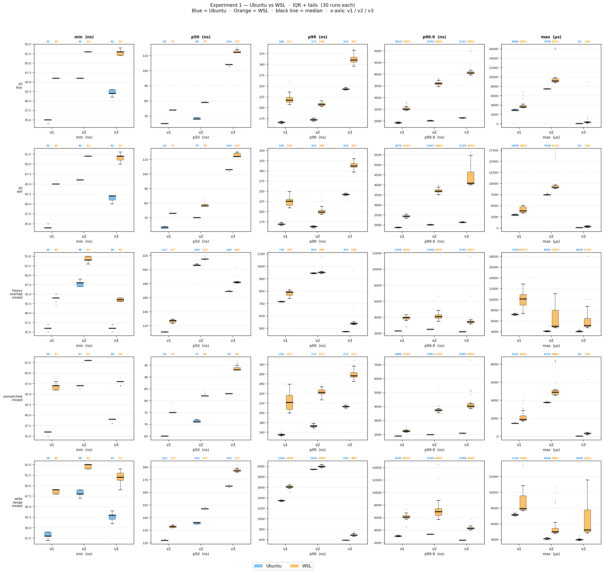

# Benchmark Stability

I examine benchmark stability across two environments: Ubuntu 24.04 running on WSL 2 and natively on Linux. However, stable benchmark does not necessarily imply benchmark correctness, so a thorough review on the benchmark implement is still required. 

## Setup

To measure benchmark stability, the `experiments/bench_stability/sweep.sh` and `experiments/bench_stability/multirun.sh` scripts are provided. Each engine from v1, v2, and v3 also support displaying the benchmark result when receiving the `--benchmark` flag when run. These outputs are then redirected by the scripts to `txt` files. 

In more detail, the `multirun.sh` will run `sweep.sh` 30 times for each engine and testcase combination. The `experiments/bench_stability/plot_exp1.py` script will then use those `txt` files and display boxplots that illustrate the distribution of the runs' benchmark result. 

## Results

After running the `multirun.sh` in both WSL 2 and native Linux, the following result is obtained. 

The figure illustrates that native Linux is provides a more stable environment for benchmark experiments. Compared to WSL 2, the native Linux runs show lower run-to-run variation. One likely explanation is that WSL 2 introduces hypervisor scheduling effects, which can cause variance in latency. Based on this observation, all upcoming experiments will be conducted on native Linux. 