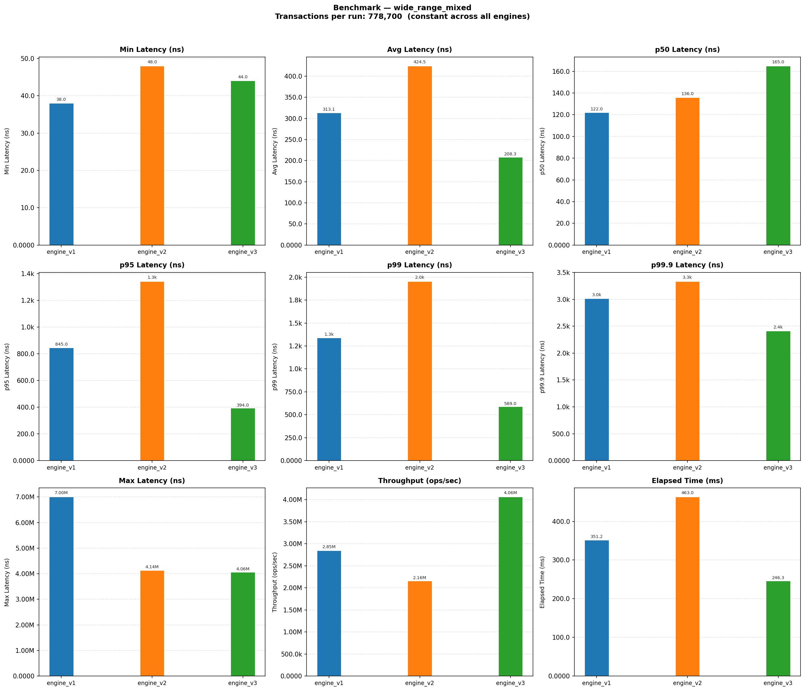
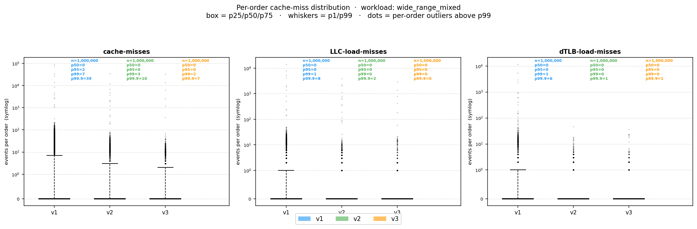
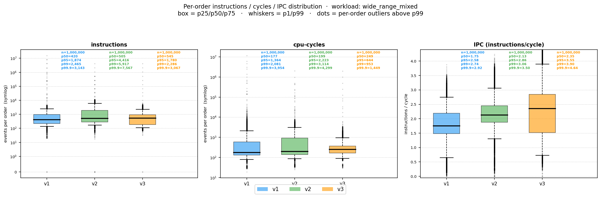
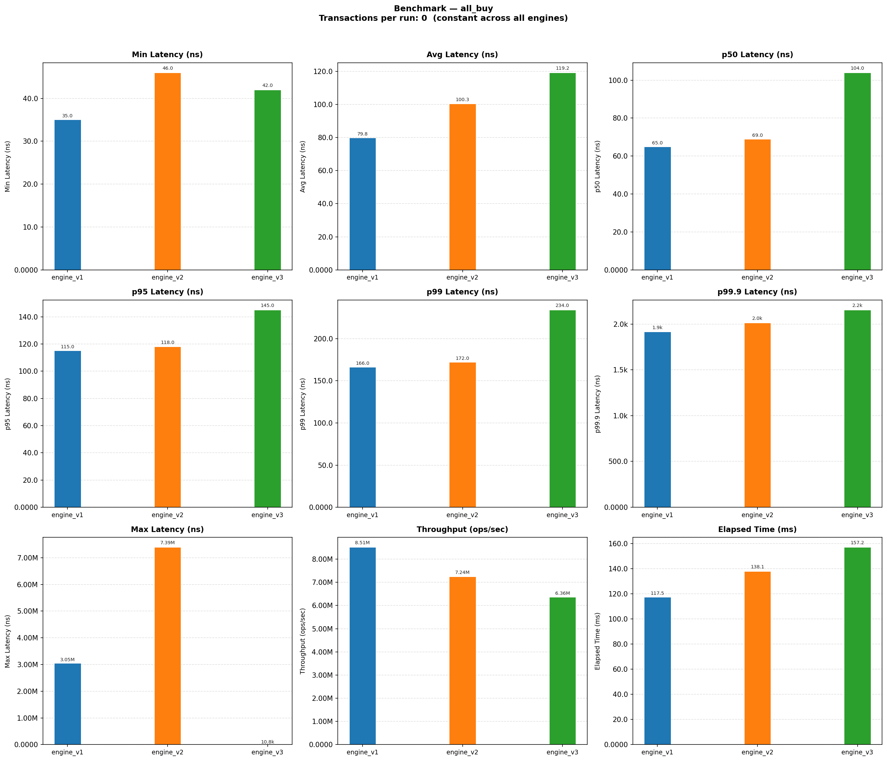

# Latency Distribution Analysis

## Research Question

When the three single-threaded engines are benchmarked on the wide-range mixed workload, we observe an interesting latency distribution pattern.



At first glance, v3 appears to have a worse median latency than v1: its p50 latency is higher. However, the trend reverses in the tail. v3 achieves lower p95, p99, and p99.9 latency than v1.

This result raises the main research question for this section:

> Why is v3’s p50 latency worse than v1’s p50 latency, while v3 achieves better p95, p99, and p99.9 latency?

## Hypothesis I: Cache Locality

The first hypothesis is that v3 has worse median latency because its internal data structures have poorer cache locality than v1.

In v1, the priority queues are backed by `std::vector`, so the heap array itself is stored contiguously. This improves spatial locality when traversing or updating the heap structure. In contrast, v3 uses a `std::map` from price levels to `std::deque<Order>`. The `std::map` is typically implemented as a red-black tree, where nodes are individually allocated on the heap. Traversing or updating the tree may therefore involve pointer chasing across scattered memory locations, increasing the likelihood of cache misses. 

The `std::deque<Order>` also does not store all elements in one contiguous memory block. Instead, it stores elements across multiple chunks. This layout can provide more stable insertion and deletion behavior than a growing `std::vector`, but it may reduce spatial locality compared with a contiguous array.

This hypothesis mainly targets the p50 behavior: if v3’s tree- and deque-based representation has weaker cache locality, it should introduce a higher occurrence of cache misses around the p50 region of the cache-access distribution for each order. 

## Verification I: Cache Distribution Analysis

To verify Hypothesis I, I use Linux `perf` to observe the distribution of cache misses, LLC load misses, and dTLB load misses for each order. 

Instead of reading performance counters through file descriptors for every order, I map the Linux `perf_event_open` metadata page into the process virtual address space using `mmap`. This enables user-space counter reads through `rdpmc`, reducing the measurement overhead that would otherwise be introduced by repeated system calls or traps. This is important because the benchmark records hardware-counter deltas at order-level granularity.

In more detail, Linux `perf` is the interface that lets us configure the CPU’s Performance Monitoring Unit, or PMU, to count specific hardware events. In our case, we are interested in measuring the following hardware events:

```c++
static EventSpec event_cache_misses() noexcept
{
    return {PERF_TYPE_HARDWARE, PERF_COUNT_HW_CACHE_MISSES, "cache-misses"};
}

static EventSpec event_llc_load_misses() noexcept
{
    return {PERF_TYPE_HW_CACHE,
            (PERF_COUNT_HW_CACHE_LL) |
                (PERF_COUNT_HW_CACHE_OP_READ << 8) |
                (PERF_COUNT_HW_CACHE_RESULT_MISS << 16),
            "LLC-load-misses"};
}

static EventSpec event_dtlb_load_misses() noexcept
{
    return {PERF_TYPE_HW_CACHE,
            (PERF_COUNT_HW_CACHE_DTLB) |
                (PERF_COUNT_HW_CACHE_OP_READ << 8) |
                (PERF_COUNT_HW_CACHE_RESULT_MISS << 16),
            "dTLB-load-misses"};
}

static EventSpec event_instructions() noexcept
{
    return {PERF_TYPE_HARDWARE, PERF_COUNT_HW_INSTRUCTIONS, "instructions"};
}

static EventSpec event_cpu_cycles() noexcept
{
    return {PERF_TYPE_HARDWARE, PERF_COUNT_HW_CPU_CYCLES, "cpu-cycles"};
}
```

After configuring the events, the `perf_event_open` will return us a file descriptor for the configured perf event. 
```c++
const int fd = static_cast<int>(::syscall(SYS_perf_event_open, &attr, 0 /*self*/, -1 /*any cpu*/, -1, 0));
```

Calling `mmap` on this descriptor maps the perf event metadata page into the process virtual address space.

```c++
void *p = ::mmap(nullptr, page_size_, PROT_READ, MAP_SHARED, fd, 0);
pages_[event_count_] = static_cast<perf_event_mmap_page *>(p);
```

The `pages_` array stores pointers to the `perf_event_mmap_page` structures for each configured event. These metadata pages contain the fields needed for low-overhead user-space counter reads, such as the counter index, offset, and seqlock. During measurement, the benchmark uses the index field to select the hardware counter with `rdpmc`, adds the corresponding offset, and uses the seqlock pattern to avoid reading inconsistent metadata while the kernel may be updating the page.


```c++
__attribute__((always_inline)) inline std::uint64_t
read_one(std::size_t i) const noexcept
{
    auto *p = pages_[i];
    std::uint64_t val;
    std::uint32_t seq;
    do
    {
        seq = p->lock;
        asm volatile("" ::: "memory");

        const std::uint32_t idx = p->index;
        const std::int64_t offset = p->offset;

        if (idx == 0)
        {
            val = static_cast<std::uint64_t>(offset);
        }
        else
        {
            std::uint32_t lo, hi;
            asm volatile("rdpmc" : "=a"(lo), "=d"(hi) : "c"(idx - 1));
            val = ((static_cast<std::uint64_t>(hi) << 32) | lo) +
                    static_cast<std::uint64_t>(offset);
        }

        asm volatile("" ::: "memory");
    } while (p->lock != seq);
    return val;
}
```

Using this measurement mechanism, I obtain the cache-distribution plot below.



The figure shows that, at the median, cache misses, LLC load misses, and dTLB load misses are all zero across v1, v2, and v3. This contradicts the initial cache-locality hypothesis for the p50 latency gap. If cache locality and pointer indirection were the primary cause of v3’s higher p50 latency, we would expect v3 to show more cache-related misses around the median order-level measurement. However, the measured distributions do not show such a difference at p50.

## Hypothesis II: Compute Cost

The cache-distribution analysis suggests that the p50 latency gap is unlikely to be explained by memory-side stalls such as cache misses, LLC load misses, or dTLB load misses. This motivates the next hypothesis: if v3’s slower median latency is not primarily memory-bound, then it may come from compute-side cost. In this context, compute-side cost refers to the amount of CPU work required to process each order. 

## Verification II: Instructions and Cycles Distribution Analysis

To verify Hypothesis II, I analyze this using three hardware-counter metrics: instruction count, cycle count, and IPC. Instruction count estimates how many instructions are executed per order, cycle count measures how many CPU cycles are spent per order, and IPC indicates how efficiently those instructions are executed.

To obtain these metrics per order, we will use the same framework for Verification I. In this case, we will use the `event_instructions()` and `event_cpu_cycles()`. 

Using this measurement mechanism, I obtain the instructions and cycles distribution plot below.



Based on the figure above, we can observe the following. At the median, v3 requires 245 cycles per order, while v1 requires 177 cycles per order. This difference aligns with the observed p50 latency gap. Since the median cache-miss, LLC-load-miss, and dTLB-load-miss counts are all zero, the measured memory-miss events do not explain the median-latency difference. The evidence therefore points toward compute-side cost: v3 performs more CPU work per order, which increases its median cycle count and contributes to its higher p50 latency.

## Analysis I: Instruction Attribution

The previous experiments suggest that v3’s higher p50 latency is associated with higher instruction count and higher cycle count, rather than measured cache-miss behavior. The next question is where this additional compute-side cost comes from.

Directly attributing this cost in the wide-range mixed workload is difficult because each order may involve both insertion and matching. As a result, the measured per-order latency combines multiple execution paths, making it unclear whether the additional instructions come from `insertOrder`, `matchOrders`, or their interaction.

To reduce this ambiguity, I analyze the all-buy and all-sell workloads. These workloads are useful isolation cases because successful matching is removed: orders arrive only on one side of the book, so the measured cost is dominated by the insertion path. Under these workloads, v3 loses not only at p50, but also at p95, p99, and p99.9 as can be shown in the plot below. This suggests that v3’s insertion path is consistently more expensive than the priority-queue-based designs.



This observation also helps interpret the original wide-range mixed result. In the mixed workload, v3 loses at p50 but wins at p95, p99, and p99.9. However, when successful matching is removed, this tail-latency advantage disappears. Therefore, the evidence suggests a two-part explanation: v3’s worse p50 latency is likely caused by the higher cost of `insertOrder`, while its better tail latency in the mixed workload is likely related to the behavior of `matchOrders`.

Instruction attribution on the all-buy and all-sell workloads can then be used to identify the source of v3’s insertion cost. Concretely, the instruction attribution uses `perf record` and `perf annotate` to produce `*.annot.txt` files where the `experiments/instruction_attribution/summarize.py` script picks up to roll up cycle samples per source line and report the lines that consume the most cycles. 

Using the mentioned mechanism, the summary of v3 `insertOrder` instruction attribution for all sell can be obtained as such. 

```
[v3]   v3_all_sell_insertOrder.annot.txt
    pct   line  source
-------  -----  ------------------------------------------------------------------------------------------------
34.82%     58  { return static_cast<_Link_type>(__x->_M_right); }
18.48%     63  __y = __x, __x = _S_left(__x);
 8.25%     53  while (__x != 0)
 7.43%     51  __x = _S_right(__x);
 7.26%     56  { return static_cast<_Link_type>(__x->_M_left); }
 6.93%     84  != this->_M_impl._M_finish._M_last - 1)
 4.29%    103  ++this->_M_impl._M_finish._M_cur;
 2.48%     74  if (__i == end() || key_comp()(__k, (*__i).first))
 1.82%     42  { return __x < __y; }
 1.65%     11  {
```

Now, we will look into the annotation file deeper to see the bigger picture of these instructions. Observe the following annotation. 

```
        : 29   _Compare, _Alloc>::iterator
        : 30   _Rb_tree<_Key, _Val, _KeyOfValue, _Compare, _Alloc>::
        : 31   _M_lower_bound(_Link_type __x, _Base_ptr __y,
        : 32   const _Key& __k)
        : 33   {
        : 34   while (__x != 0)
0.00 :   415d:   test   %rdx,%rdx
0.00 :   4160:   je     41f8 <insertOrder(Order const&)+0xc8>
        : 37   struct less : public binary_function<_Tp, _Tp, bool>
        : 38   {
        : 39   _GLIBCXX14_CONSTEXPR
        : 40   bool
        : 41   operator()(const _Tp& __x, const _Tp& __y) const
        : 42   { return __x < __y; }
0.00 :   4166:   lea    0x725b(%rip),%r8        # b3c8 <asks+0x8>
0.00 :   416d:   mov    0x10(%rdi),%rdi
1.82 :   4171:   mov    %r8,%rsi
0.00 :   4174:   jmp    4188 <insertOrder(Order const&)+0x58>
0.00 :   4176:   cs nopw 0x0(%rax,%rax,1)
        : 48   if (!_M_impl._M_key_compare(_S_key(__x), __k))
        : 49   __y = __x, __x = _S_left(__x);
        : 50   else
        : 51   __x = _S_right(__x);
7.43 :   4180:   mov    %rcx,%rdx
        : 53   while (__x != 0)
8.25 :   4183:   test   %rdx,%rdx
0.00 :   4186:   je     41a1 <insertOrder(Order const&)+0x71>
        : 56   { return static_cast<_Link_type>(__x->_M_left); }
7.26 :   4188:   mov    0x10(%rdx),%rax
        : 58   { return static_cast<_Link_type>(__x->_M_right); }
34.82 :   418c:   mov    0x18(%rdx),%rcx
        : 60   if (!_M_impl._M_key_compare(_S_key(__x), __k))
1.16 :   4190:   cmp    %rdi,0x20(%rdx)
0.00 :   4194:   jb     4180 <insertOrder(Order const&)+0x50>
        : 63   __y = __x, __x = _S_left(__x);
10.23 :   4196:   mov    %rdx,%rsi
8.25 :   4199:   mov    %rax,%rdx
        : 66   while (__x != 0)
0.17 :   419c:   test   %rdx,%rdx
0.00 :   419f:   jne    4188 <insertOrder(Order const&)+0x58>
```

These instructions account for 79.39% of `insertOrder`'s sampled cycles, and the source labels identify them as `std::_Rb_tree::_M_lower_bound`, the red-black-tree binary search that `std::map::operator[]` runs to locate the price level for `order.price`. This supports the explanation that v3’s p50 penalty comes primarily from red-black tree traversal and lookup.

## Analysis II: Matching Logic Complexity

It is mentioned previously the fact that engine v3 has better tail latency in the mixed workload is likely related to the behavior of `matchOrders`, specifically the algorithm complexity. Therefore, we will analyse the algorithmic complexity for `matchOrders` function in greater detail. The complexity of each engine's matching logic is as follows:

| Engine | Single matching logic complexity | Number of bytes for comparison |
|---:|---|---|
| `v1` | $1 \times O(\log N)$ on partial match, $2 \times O(\log N)$ on exact match | 8, `sizeof(Order*)` | 
| `v2` | $3 \times O(\log N)$ on partial match, $2 \times O(\log N)$ on exact match | 24, `sizeof(Order)` | 
| `v3` | $O(1)$ for `rbegin` or `begin` access + $O(1)$ amortized for deque operation + $O(1)$ amortized for erase using iterator | - | 

The table shows that the engine v3 matching logic is cheaper in terms of big O notation than engine v1 and v2, which supports the idea why engine v3 has better tail latency. 